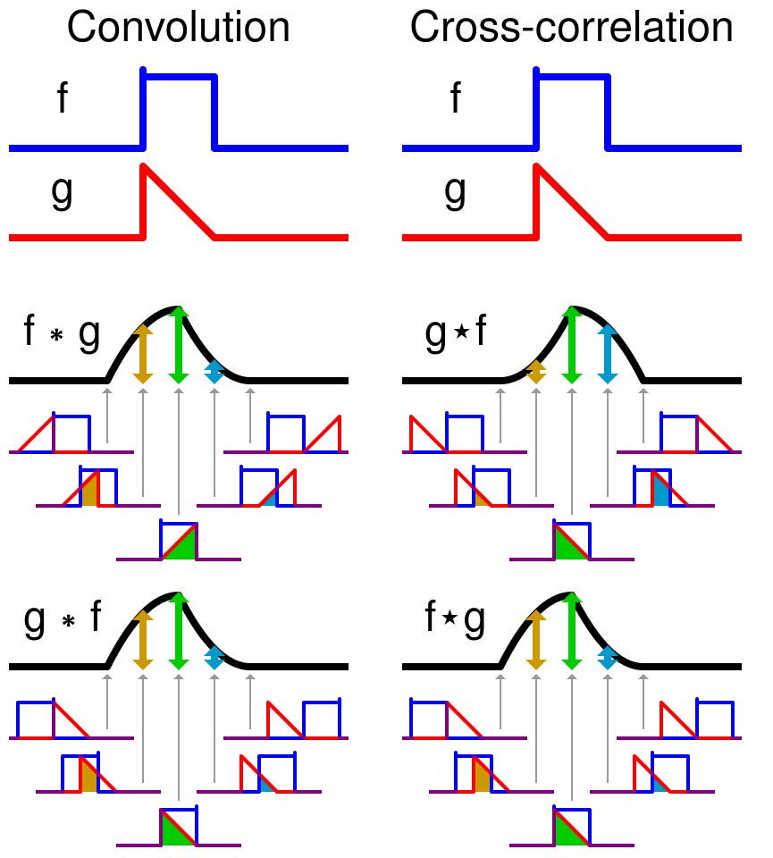

# Úvod
## Motivace
- co to je digitální zpracování obrazu? Je to na průsečíku:
	- aplikovaná matematika
	- computer science
	- opto-elektronika
	- AI a robotika
- 0 až L -> barevná hloubka obrázku (typicky L=255)
- zpracovávání barevných obrázků je ve většině případů jen zpracovávání jednotlivých RGB šedo-tónových  obrázků
- různé barevné modely - RGB, HSV, YUV
- multispectral imaging - rozšířeno o další pásma světla - IR, UV, ... 
	- 3 až několik desítek pásem
	- některé družice mají stovky pásem - hyperspectral imaging
	- multimodal - více modalit - v medicíně - CT, PET
	- složitá vizualizace
- obrázky jsou často degradované
	- rozostření, šum, deformace, zastínění, kontrast
	- jak zvyšovat kvalitu?
	- i když zlepšíme obrázek z matematického pohledu, tak to neznamená, že to bude vypadat dobře (pro lidi)
		- to je rozdíl mezi uživatelem a expertem
- historie
	- vzniklo již před počítačem! - pro účely přenosu fotek redakcím dálnopisem - první 1921  
	- 1964 - fotky ze satelitů - první digitální senzory
	- 1963 - atentát na JFK - co se dá z fotek z místa činu zjistit? první nasazení image processing technik
		- dnes se využívá u soudu
- aplikace
	- medicína
	- bezpečnost
	- forenzní využití
	- vizuální systémy pro AI
- image processing x computer graphics
	- computer graphics - tvoří obrázky v počítači
	- image processing - pracuje se stávajícími obrázky -> upravuje je, něco z nich zjišťuje
	- jsou si velmi podobné
- rozdělení:
	- **digitalizace** - jak ho získáme? snímání
		- jsme z těch dat schopni znovu zrekonstruovat původní scénu?
	- **preprocessing** - snaha o "opravu" obrázku (vstup obrázek -> výstup obrázek)
	- **image analysis** - detekce a rozpoznávání, pochopení scény (vstup obrázek -> výstup informace vyšší úrovně)
	- image coding - komprese (nebudeme tady o tom vůbec mluvit)
## Matematické pozadí - co budeme hodně využívat
### Konvoluce
- přiřazuje 2 funkcím jinou třetí funkci - POZOR výsledkem není číslo!
- fci f necháme, **funkci g převrátíme podle osy**, "projdeme" funkcí g po každém bodě fce f
	- vlastně to počítá vážený průměr
- definujeme nad $L_1$ - prostor integrovatelných funkcí
	- rozšíříme o delta funkci $\delta$ - limita obdélníků (zužujeme čtverec ale zachováváme obsah)
		- je to jednotka při konvoluci
			- $f \ast \delta = f$ 
- definice:
	- $\ast: L_1 \times L_1 \rightarrow L_1$
	- $(f \star g)(x) = \int_{-\infty}^\infty f(t)g(x-t)dt$
- vlastnosti
	- $f \ast g = g \ast f$
	- $\alpha (f \ast g) = (\alpha f) \ast g = f \ast (\alpha g)$
	- ... (prakticky stejné jako násobení)
- diskrétní konvoluce
	- 
	- není mezi funkcemi ale mezi maticemi
	- vstupní matice a matice vah (maska) -> aplikujeme masku na každou hodnotu vstupní matice 
		- pokud maska není symetrická, pak ji musíme převrátit na obou osách
	- pro diskrétní situaci je specifický - boundary efekt
		- co se děje na okraji kde se nám už nevejde maska?
		- řešení:
			- doplním nuly
			- zrcadlím obrázek
			- periodické rozšíření
	- výpočetní složitost
		- z def $O(N^2 M^2)$ -> pomalé
		- když je kernel rank 1 -> pak $O(N^2M)$
		- pro kernel 7x7 už se nejspíš vyplatí něco chytřejšího -> Fourier
### Cross-korelace
- prakticky je to konvoluce, která ale nepřevrátí g podle osy
	- => $f \star g \neq g \star f$
- definice:
	- $\star: L_1 \times L_1 \rightarrow L_1$
	- $(f \star g)(x) = \int_{-\infty}^\infty f(t)g(t-x)dt$
		- Pozor tady je $t-x$, kdežto u konvoluce je $x-t$
- 
### Fourier transform 
- Fourier series
	- Fourierovi koeficienty $c_k=(f, \phi_k)$
	- aproximace funkce
- máme ortonormální systém $\{\phi_u(x)\}=\{e^{-2\pi i(ux)}\}$
- Vzorec: $$F(u) = \int_R f(x)e^{-2\pi i u x}dx,\quad f(x)=\int_R F(u)e^{2\pi i u x}du$$
- na rozdíl od diskrétního případu máme k dispozici nespočetně mnoho koeficientů $u$
- FT pro f značíme F (F existuje pokud $f \in L_1$, ale neplatí obecně že $F \notin L_1$)
- pro funkci je FT jednoznačně daná (f <-> F)
- pro imaginární číslo zapsané v gaussově rovině je:
	- **fáze** úhel od  přímky dané bodem imag čísla k počátku a to k ose x
	- **amplituda** je vzdálenost bodu imag čísla k počátku
	- $F = \Re(F) + i\Im(F)=|F|e^{iph(F)}$
- máme teorémy
	- je lineární
		- říká: zvětšení nebo sečtení hodnot v obrazové oblasti odpovídá tomu stejnému ve frekvenční
	- konvoluční
		- $$F[f]F[g] = F[f\ast g]$$
			- kde nalevo máme normální násobení v oblasti frekvenční
			- a napravo máme konvoluci v oblasti např obrazové/časové
		- říká: násobení v oblasti frekvenční je stejné jako konvoluce v oblasti obrazové/časové
		- POZN: počítání konvoluce je pomalé, ale násobení je rychlé, takže se může hodit pro zrychlení algoritmů
	- shift
		- $$F[f(x-a)](k) = e^{-2\pi ika}F[f](k)$$
		- říká: posunutí v oblasti obrazové nezmění frekvenční oblast
	- rotační
		- $$F[R(f)] = R(F[f])$$
		- říká: pokud zrotujeme obrazovou oblast zrotuje se i frekvenční
	- scaling
		- $$F[f(ax)](k) = |a|^{-1}F(\frac{k}{a})$$
		- říká: pokud zvětšujeme obrazovou oblast , pak se frekvenční zmenšuje a naopak
- POZN: konvoluční a shift teorém platí jen pro periodické prodloužení
	- (lepíme ten obrázek opakovaně vedle sebe)
- POZN: support funkce = množina bodů kde je funkce nenulová
	- kompaktní support = support který je uzavřený a omezený
- POZN: FT sin nebo cos je delta funkce posunutá na "souřadnice" harmonické funkce v bázi
- POZN: pro obdélníkový pulz nám vznikne tzv. sinc funkce
- diskrétní (DFT):
	- $F_n=\sum_{k=0}^{N-1}f_ke^{-2\pi i n k /N}$
	- $f_n=\frac{1}{N}\sum_{k=0}^{N-1}F_ke^{-2\pi i n k /N}$
	- čím více členů, tím bližší aproximace
	- spektra zobrazujeme tak že uprostřed je nula, na konci je frekvence s periodou dvojnásob vzorkovacího rozlišení
	- 1. frekvence jde jednou přes všechny
	- 2. frekvence jde 2x přes všechny
	- poslední n/2 x přes všechny
	- fast FT (FFT)
		- z definice FT $O(N^2)$
		- FFT $O(N \log N)$
			- je opravdu rychlejší
- filtry
	- low pass
		- odstraním vysoké frekvence - rohy, detaily
		- masky s kladnými koeficienty - rozmazání
	- high pass
		- odstraním nízké frekvence - plochy, hladké přechody
		- masky se zápornými koeficienty - detekce hran
		- směrové - detekce hran v určitém směru
- Fáze x amplituda
	- fáze nese informace o struktuře - prakticky co tam je
		- je důležitější pro rekonstrukci obrázku než amplituda!
	- amplituda nese informace o tom kolik tam je určité frekvence
- Image whitening $$w(x,y) = F^{-1}\frac{F(u,v)}{|F(u,v)|}$$
	- vyextrahuje jen fázovou složku (normalizace amplitudou)
- ve 2D
	- Vzorce: $$\{\phi_{uv}(x,y)\}=\{e^{-2\pi i(ux+uv)}\}$$ $$F(u,v)=\int \int _{R^2} f(x,y)e^{-2\pi i(ux+vy)}$$
		- funkce budou vypadat "jako vlnitý plech", to vychází z rotačního teorému protože víme jak vypadají pro u = 0 / v = 0 (to jsou prostě harmonické funkce roztáhlé do 2D)
	- POZN: vizualizace je logaritmická (jinak by bod v 0 přebil všechno ostatní)
			- na obdélníku vidíme hezky scale teorém

- *otázky u zkoušky*
	- *dokažte x teorém*
	- *přečíst spektrum*
	- *proč bychom chtěli použít daný filtr a co by to znamenalo*
		- *jak toho stejného dosáhnout pomocí konvoluce*
	- *definice*
- *DÚ*
	- *libovolně velká maska jen s jedničkami*
	- *uděláme předvýpočet*
	- *pak konvoluce v $O(1)$*
	- *jak na předvýpočet?*

  
Řešení

  
[Moje řešení](hw/sum_array.py) - říkám tomu "sum array"
  
Dle wikipedie se to jmenuje [Summed-area table](https://en.wikipedia.org/wiki/Summed-area_table)

